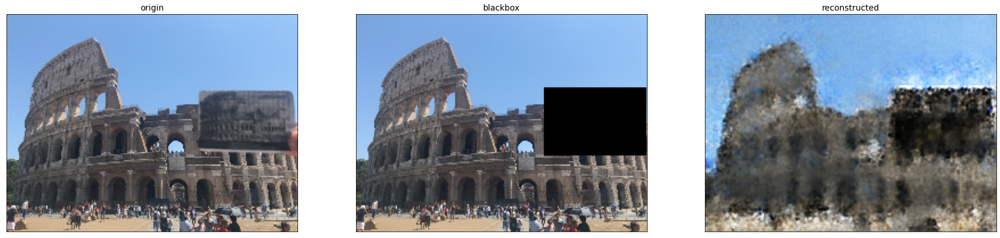

# Project : Photo Eraser

- Restore Landmark Picture by Obstacle in front of Camera.

## My Laptop Env

- CPU : AMD Ryzen 9 5900HS
- RAM : 16GB
- GPU : RTX3070 Lapto GPU(8GB)

## Main Lib Environment

- Python : ver. 3.10.4
- Tensorflow : ver. 2.9.1
- opencv-python : ver. 4.6.0

## Data

### Train Data

- Kaggle Image Matching Challenge 2022 Dataset
  - link : https://www.kaggle.com/competitions/image-matching-challenge-2022/data
  - Use Train Colosseum Exterior : 130ea

<!-- ### Test Data

- Kaggle Image Matching Challenge 2022 Dataset
  - link : https://www.kaggle.com/competitions/image-matching-challenge-2022/data
  - Use Train Colosseum Exterior
- My Pictures -->

## Create Datasets

- Create 12-Black Masks(64x64) for each train image.
  

## Model : Auto Encoder

```
class ConvAutoencoder(Model):
    def __init__(self):
        super(ConvAutoencoder, self).__init__()
        self.autoenc_model, self.encoder, self.decoder = self.build_model()

    def build_model(self):
        input_img = layers.Input(shape=(192, 256, 3))
        x = layers.Conv2D(256, 3, strides=2, activation="relu", padding="same")(input_img)
        x = layers.Conv2D(128, 3, strides=2, activation="relu", padding="same")(x)
        x = layers.Conv2D(64, 3, strides=2, activation="relu", padding="same")(x)
        x = layers.Conv2D(32, 3, strides=2, activation="relu", padding="same")(x)
        encoded = layers.Conv2D(16, 3, strides=2, activation="relu", padding="same", name="encoded")(x)

        x = layers.Conv2DTranspose(16, 3, strides=2, activation="relu", padding="same")(encoded)
        x = layers.Conv2DTranspose(32, 3, strides=2, activation="relu", padding="same")(x)
        x = layers.Conv2DTranspose(64, 3, strides=2, activation="relu", padding="same")(x)
        x = layers.Conv2DTranspose(128, 3, strides=2, activation="relu", padding="same")(x)
        x = layers.Conv2DTranspose(256, 3, strides=2, activation="relu", padding="same")(x)
        decoded = layers.Conv2D(3, 3, activation="sigmoid", padding="same", name="decoded")(x)
        autoencoder = tf.keras.Model(input_img, decoded)
        autoencoder.compile(optimizer="adam", loss=losses.MeanSquaredError(), metrics=["accuracy"])
        encoder = tf.keras.Model(input_img, encoded)
        decoder = tf.keras.Model(encoded, decoded)
        return autoencoder, encoder, decoder

    def call(self, x):
        encoded = self.encoder(x)
        decoded = self.decoder(encoded)
        return decoded
```

## Result

- Restore Image with low resolution.
  

## More

- If Better Computing Env...
  - Deeper Network.
  - More Batch Size.
  - Bigger Image Size.
- Use other GAN Models.
  - Cycle GAN.
  - SinGAN.
